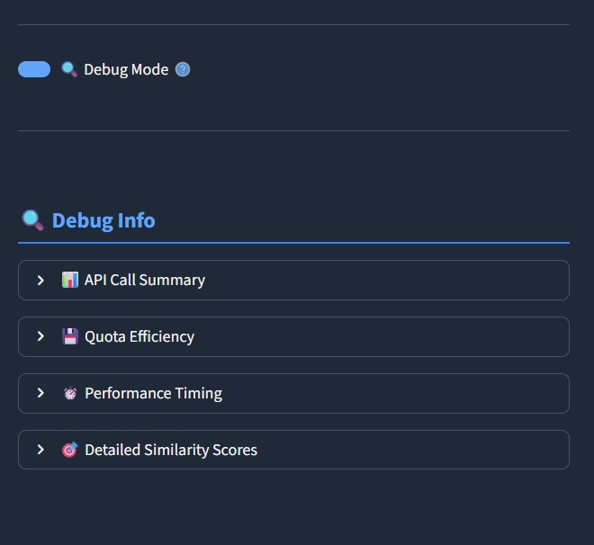
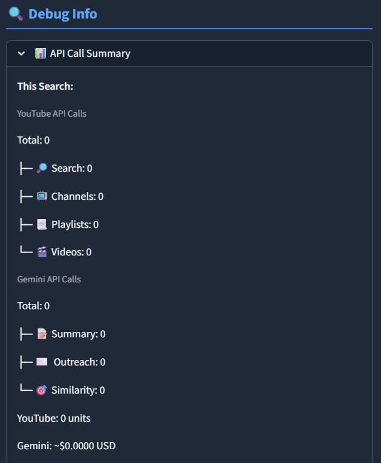
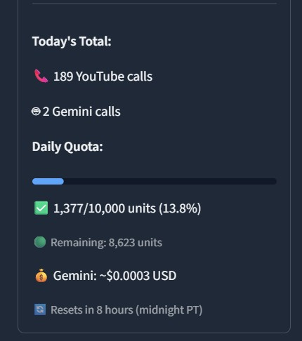
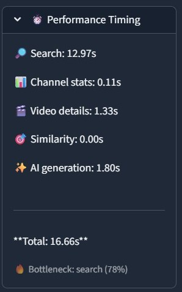

# CCSeeker 🔍

<div align="center">


**Discover Niche YouTube Creators**

*AI-powered creator discovery tool with intelligent search and similarity ranking*

[](https://www.python.org/downloads/)
[](https://streamlit.io/)
[](LICENSE)

[Features](#-features) • [Demo](#-demo) • [Installation](#-installation) • [Tech Stack](#-tech-stack) • [Architecture](ARCHITECTURE.md)

</div>

---

## 🎯 The Problem

Digital marketers spend hours manually searching for niche content creators on YouTube:
- **Time-intensive**: Manual channel discovery takes 4-6 hours per campaign
- **Limited tools**: Existing solutions are expensive or lack depth
- **Knowledge gap**: Finding creators when you don't know the exact terminology of the niche is difficult

## 💡 The Solution

CCSeeker automates niche creator discovery with two intelligent search approaches:

1. **🔑 Keyword Search** - Search by topic using hybrid video + channel name matching
2. **📺 Channel-as-Seed** - Find similar creators by analyzing an example channel's content

The system ranks results using a blend of algorithmic scoring (80%) and AI semantic analysis (20%), tracks API usage to stay within free quotas, and generates AI-powered summaries and outreach emails.

---

## ✨ Features

### 🧠 Dual Search Modes

<details open>
<summary><strong>Keyword Search Mode</strong></summary>


- **Multi-term support**: Search with up to 2 comma-separated topics
- **Prioritize region**: Where channels are more relevant
- **Hybrid matching**: Finds channels by video content AND channel names
- **Smart ranking**: Channels with 8 relevant videos (80 pts) outrank those with keyword only in name (5 pts)
- **Visual term counter**: Real-time feedback on query validity

### 🔍 Advanced Filtering


- **Subscriber threshold**: Set minimum audience size
- **Geographic targeting**: Filter by channel country
- **Activity filter**: Only show channels with uploads in last X months
- **Relevance threshold**: Automatically excludes channels with <15% keyword match

### Search Results
Results table shows relevance scores, subscriber counts, engagement rates, and more.


### 🤖 AI-Powered Features

- **Channel Summaries**: Auto-generated overviews using Google Gemini

- **Outreach Emails**: Personalized drafts in English or Spanish


</details>

<details open>
<summary><strong>Channel-as-Seed Mode</strong></summary>


- **Paste any YouTube channel URL** and the system:
  - Analyzes 50 recent videos
  - Detects content language (EN/ES)
  - Calculates engagement patterns and upload frequency
  

- **Topic Extraction**: Identifies niche keywords from video titles and tags
  
  

- **AI enhancement**: Gemini analyzes top 10 matches for "vibe" similarity


- **Seed detailed match analysis**: Deep dive into why channels match the seed.


- **Multi-signal similarity scoring** (100-point scale):
  - Tag overlap (30%) - Jaccard similarity
  - Keyword matching (30%) - Title keywords (bigrams + unigrams)
  - Subscriber tier (15%) - prevents 10M vs 10K mismatches
  - Engagement rate (17%)
  - Upload frequency (8%)

  Final score = 80% algorithmic + 20% AI semantic analysis

  
</details>

### 📊 Debug & Monitoring System

<details>
<summary><strong>Real-Time API Tracking</strong></summary>

### Debug Panel
*Collapsible sidebar provides transparency into API usage and performance metrics*

Toggle debug mode to see:



**API Call Summary**


- Tracks YouTube (search, channels, videos, playlists)
- Tracks Gemini (summary, outreach, similarity)
- Shows quota units consumed
- Estimates costs

**Performance Timing**

- Measures each pipeline stage
- Identifies bottlenecks
- Total execution time

**Quota Efficiency**

- Compares current vs baseline usage
- Tracks total runs for same search
- Shows cache effectiveness

</details>

---

## 🚀 Tech Stack

| Technology | Purpose | Why This Choice |
|------------|---------|-----------------|
| **Python 3.11** | Core language | Rich ecosystem for data processing |
| **Streamlit 1.49** | Web UI framework | Built-in caching, state management, rapid iteration |
| **YouTube Data API v3** | Channel/video data | Official API, ToS-compliant (no scraping) |
| **Google Gemini AI** | Topic extraction & content generation | Free tier (15 RPM, 1M tokens/min) |
| **Pandas** | Data processing | Efficient filtering and transformations |
| **pytest** | Unit testing | Industry standard, easy mocking |

### Key Design Decisions

**Layered Architecture**
- Core business logic separated from UI in `app/core/`
- Pure functions that are Streamlit-agnostic and unit testable
- Cache layer wraps core functions with Streamlit caching

**Blended Scoring (80% Algorithmic + 20% AI)**
- Algorithmic scoring is deterministic and fast
- AI adds semantic understanding for nuanced matching
- Blend gets benefits of both approaches

**Per-Channel Caching**
- Traditional approach: Cache entire search results → duplicates videos from popular channels
- CCSeeker approach: Cache each channel's videos independently (24hr TTL)
- Benefit: Popular channels appear in multiple searches → reuse cached data

**Filter Before Fetching Videos**
- Apply subscriber/country filters BEFORE analyzing videos
- Saves API quota - no point fetching 10 videos from a 500-sub channel if minimum is 10K

---

## 🧪 Testing

CCSeeker has a comprehensive test suite covering core business logic.

### Running Tests

```bash
# Run all tests
pytest tests/

# Run specific module
pytest tests/test_pipeline.py

# Run with verbose output
pytest tests/ -v
```

### Test Coverage

| Module | Tests | Coverage |
|--------|-------|----------|
| `test_query_utils.py` | 21 | Query validation, URL parsing, edge cases |
| `test_relevance.py` | 13 | Keyword matching, weights, empty inputs |
| `test_youtube_api.py` | ~20 | Search results, channel stats, error handling |
| `test_gemini_api.py` | ~15 | AI scoring, summary generation, API failures |
| `test_pipeline.py` | ~25 | Full pipeline, filters, early exits, callbacks |

All tests use mocked API clients - no actual API calls needed.

---

## 📦 Installation

### Prerequisites
- Python 3.11
- [YouTube Data API v3 key](https://console.cloud.google.com/apis/credentials)
- [Google Gemini API key](https://aistudio.google.com/apikey)

### Setup

```bash
# Clone repository
git clone https://github.com/MartinDorado/CCSeeker.git
cd CCSeeker

# Create virtual environment
python -m venv .venv

# Activate virtual environment
# Windows:
.venv\Scripts\activate
# macOS/Linux:
source .venv/bin/activate

# Install dependencies
pip install -r requirements.txt

# Configure API keys
cp .env.example .env
# Edit .env and add your keys:
# YOUTUBE_API_KEY=your_youtube_key_here
# GEMINI_API_KEY=your_gemini_key_here
```

### Run

```bash
streamlit run app/main.py
```

App opens at `http://localhost:8501`

---

## 📖 Usage

### Quick Start: Keyword Search

1. Select **🔑 Keywords** mode
2. Enter 1-2 search terms (e.g., "manga, anime")
3. Relevant in: Country (default: Global)
3. Set filters:
   - Minimum subscribers (default: 1,000)
   - Channel's origin country (default: Global)
   - Recent activity (default: 8 months)
4. Click **Find Creators**

Results show:
- Relevance score (80% keyword match + 20% AI)
- Subscriber count
- Average views per video
- Engagement rate
- Country

### Quick Start: Seed-Based Discovery

1. Select **📺 Channel-as-Seed** mode
2. Paste YouTube channel URL
3. Click **Analyze Seed**
4. Review extracted topics and AI summary
5. Optionally edit generated search query
6. Set filters and click **Find Similar Channels**

Results ranked by similarity score (0-100) with match reasons.

### AI Features

**Generate Summary** (after search completes)
- Scroll to AI Generated Summary section
- Automatically creates overview of top channels

**Create Outreach Emails**
- Select language (English/Español)
- Click **Generate Outreach Drafts**
- Get personalized email templates for TOP 3.

---

## 🗂️ Project Structure

```
CCSeeker/
├── app/
│   ├── core/                        # Pure business logic (Streamlit-agnostic)
│   │   ├── query_utils.py           # Query validation, URL parsing
│   │   ├── relevance.py             # Keyword relevance scoring
│   │   ├── youtube_api.py           # YouTube API wrappers
│   │   ├── gemini_api.py            # Gemini AI wrappers
│   │   └── pipeline.py              # Search pipeline orchestration
│   │
│   ├── cache/                       # Caching layer
│   │   └── cache_layer.py           # Streamlit cache wrappers
│   │
│   ├── main.py                      # Main UI & integration
│   ├── seed_topics_v2.py            # Seed channel analysis
│   ├── similarity_engine.py         # Multi-factor similarity scoring
│   ├── debug_tracker.py             # API tracking & performance
│   ├── feedback_tracker.py          # User feedback collection
│   └── smart_cache.py               # Per-channel video caching
│
├── tests/                           # Unit test suite
│   ├── test_query_utils.py
│   ├── test_relevance.py
│   ├── test_youtube_api.py
│   ├── test_gemini_api.py
│   └── test_pipeline.py
│
├── docs/
│   ├── appicons/                    # App icons
│   └── screenshots/                 # App screenshots
│
├── .streamlit/                      # Streamlit config
├── requirements.txt                 # Python dependencies
├── ARCHITECTURE.md                  # Technical deep dive
├── CLAUDE.md                        # AI assistant guide
└── README.md                        # This file
```

**Key Functions:**

| Function | File | Purpose |
|----------|------|---------|
| `run_search_pipeline()` | core/pipeline.py | Main search orchestration |
| `search_channels_hybrid()` | core/youtube_api.py | YouTube hybrid search |
| `calculate_keyword_relevance()` | core/relevance.py | Keyword matching algorithm |
| `generate_ai_relevance_score()` | core/gemini_api.py | AI semantic scoring |
| `analyze_seed_channel_v2()` | seed_topics_v2.py | Seed channel topic extraction |
| `calculate_similarity_score()` | similarity_engine.py | Multi-factor similarity |
| `get_channel_stats_cached()` | cache/cache_layer.py | Cached channel data |
| `track_api_call()` | debug_tracker.py | API usage tracking |

---

## 📊 API Quotas & Costs

### YouTube Data API v3 (Free Tier)
- **Daily Quota**: 10,000 units
- **Cost per operation**:
  - Search: 100 units
  - Channels: 1 unit
  - Videos: 1 unit
  - Playlists: 1 unit

**Typical search cost**: ~250 units (varies based on cache hits)

Enable debug mode to see real-time usage.

### Google Gemini API (Free Tier)
- **Rate Limits**: 15 requests/min, 1M tokens/min
- **Cost**: Free tier available
- **Paid tier**: ~$0.10-0.30 per 1M tokens (if needed)

---

## 🔒 Security & Best Practices

- ✅ API keys stored in `.env` (git-ignored)
- ✅ Graceful error handling for API failures
- ✅ Input validation (query truncation, URL parsing)
- ✅ Rate limiting awareness via debug panel
- ✅ No web scraping (ToS-compliant API usage)

---

## 🚧 Known Limitations

- **YouTube API Quota**: 10K units/day limits search volume
- **Language Support**: Seed topic extraction optimized for English/Spanish content. Other languages fall back to English stopwords.
- **Cache Staleness**: 24hr TTL may show outdated data for rapidly changing channels
- **No Historical Data**: Can't analyze deleted videos or past performance

---

## 📄 License

This project is licensed under the Apache License 2.0 - see [LICENSE](LICENSE) for details.

---

## 👤 Author

**Martín Dorado**
- LinkedIn: [linkedin.com/in/martin-dorado](https://www.linkedin.com/in/martin-dorado/)
- GitHub: [@MartinDorado](https://github.com/MartinDorado)

---

## 📚 Additional Resources

- **[ARCHITECTURE.md](ARCHITECTURE.md)** - Deep dive into system design, scoring algorithms, and caching
- **[CLAUDE.md](CLAUDE.md)** - Quick reference for AI assistants and developers
- **[YouTube API Docs](https://developers.google.com/youtube/v3)** - Official API reference
- **[Gemini API Guide](https://ai.google.dev/docs)** - AI integration documentation

---

<div align="center">

</div>
