# CCSeeker 🔍

<div align="center">

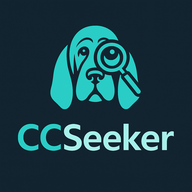

**Discover Niche YouTube Creators**

*AI-powered creator discovery tool with intelligent search and similarity ranking*

[](https://www.python.org/downloads/)
[](https://streamlit.io/)
[](LICENSE)

[Features](#-features) • [Demo](https://ccseeker.streamlit.app/) • [Architecture](ARCHITECTURE.md)

</div>

---

## 🎯 The Problem

Digital marketers spend hours manually searching for niche content creators on YouTube:
- **Time-intensive**: Manual channel discovery takes hours per campaign
- **Limited tools**: Existing solutions are expensive or lack depth
- **Knowledge gap**: Finding creators when you don't know the exact terminology of the niche is difficult

## 💡 The Solution

CCSeeker automates niche creator discovery turning hours of manual search into a few minutes with two intelligent search approaches:

1. **🔑 Keyword Search** - Search by topic using hybrid video + channel name matching
2. **📺 Channel-as-Seed** - Find similar creators by analyzing an example channel's content

The system ranks results using a blend of algorithmic scoring (80%) and AI semantic analysis (20%), tracks API usage to stay within free quotas, and generates AI-powered summaries and outreach emails.


## ✨ Features

### 🧠 Dual Search Modes

<details>
<summary><strong>🔑 Keyword Search Mode</strong></summary>

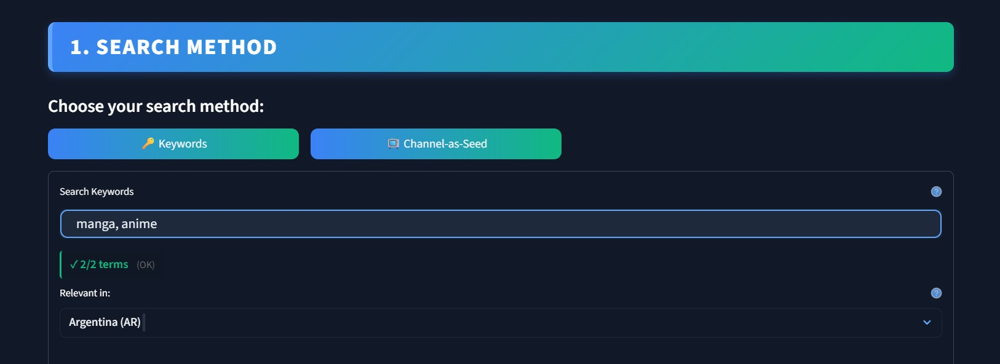

- **Multi-term support**: Search with up to 2 comma-separated topics
- **Prioritize region**: Where channels are more relevant
- **Hybrid matching**: Finds channels by video content AND channel names
- **Smart ranking**: Channels with 8 relevant videos (80 pts) outrank those with keyword only in name (5 pts)
- **Visual term counter**: Real-time feedback on query validity

### 🔍 Advanced Filtering

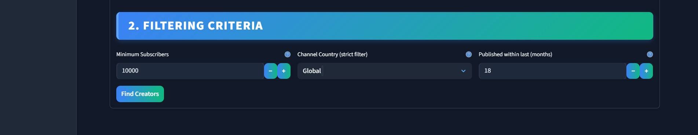

- **Subscriber threshold**: Set minimum audience size
- **Geographic targeting**: Filter by channel country
- **Activity filter**: Only show channels with uploads in last X months
- **Relevance threshold**: Automatically excludes channels with <15% keyword match

### Search Results
Results table shows relevance scores, subscriber counts, engagement rates, and more.

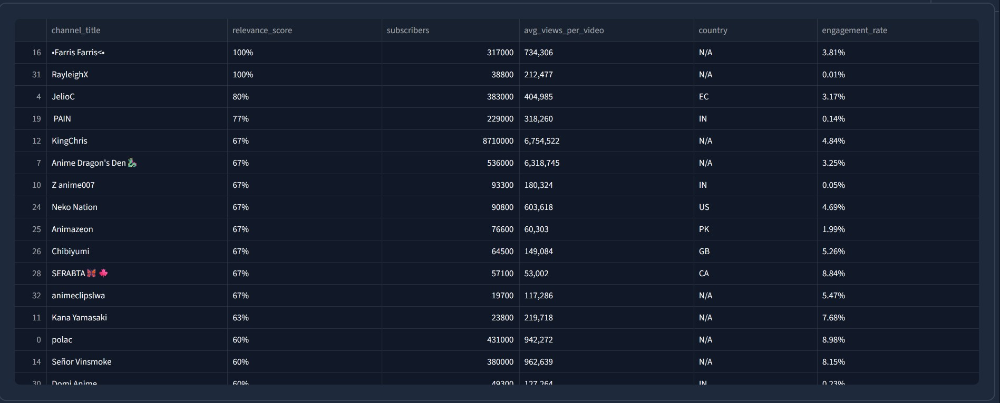

### 🤖 AI-Powered Features

- **Channel Summaries**: Auto-generated overviews using Google Gemini
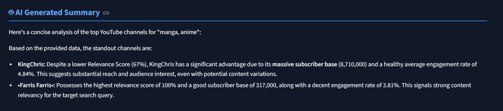
- **Outreach Emails**: Personalized drafts in English or Spanish
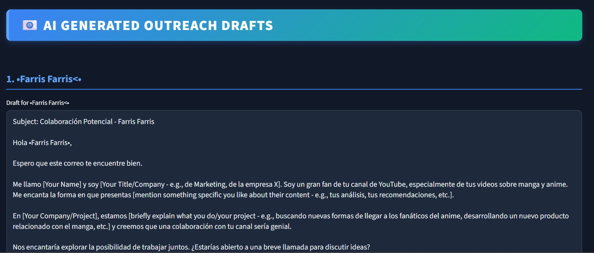

</details>

<details>
<summary><strong>📺 Channel-as-Seed Mode</strong></summary>

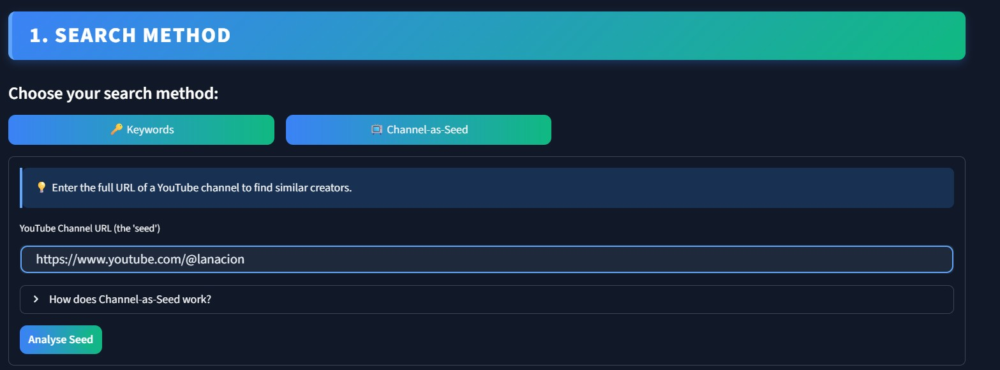

- **Paste any YouTube channel URL** and the system:
  - Analyzes 50 recent videos
  - Detects content language (EN/ES)
  - Calculates engagement patterns and upload frequency
  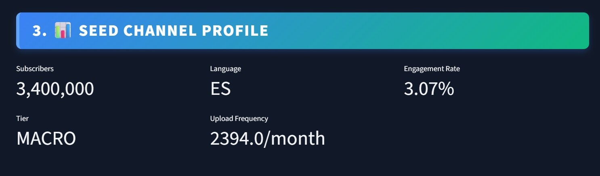

- **Topic Extraction**: Identifies niche keywords from video titles and tags
  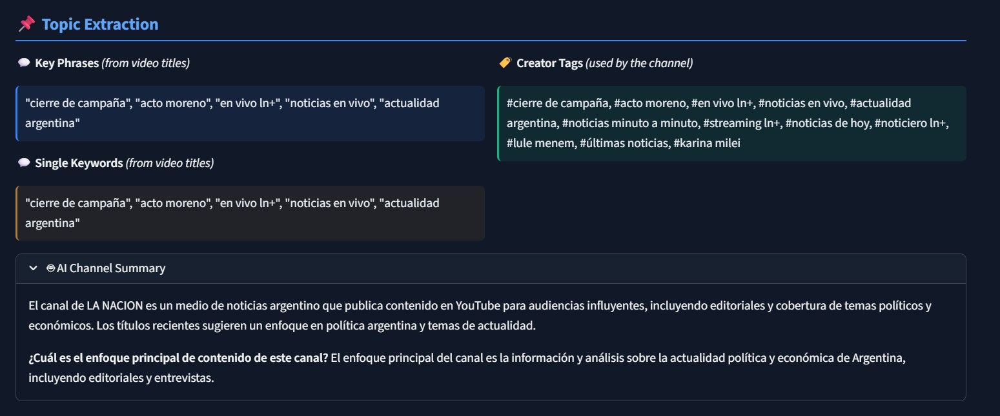
  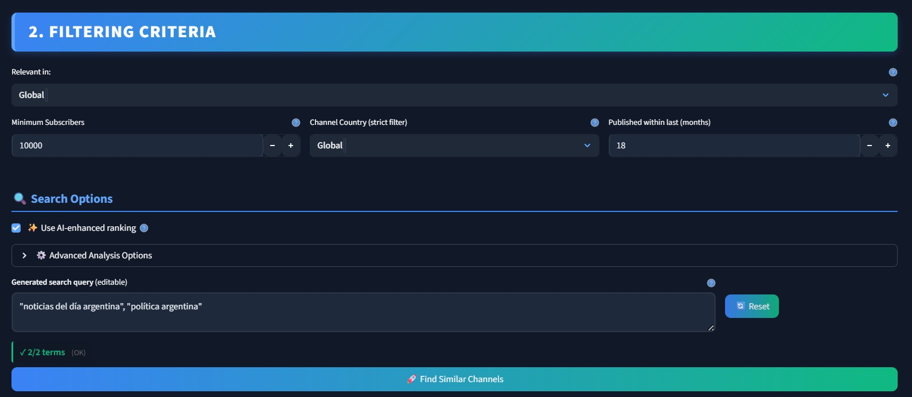

- **AI enhancement**: Gemini analyzes top 10 matches for "vibe" similarity
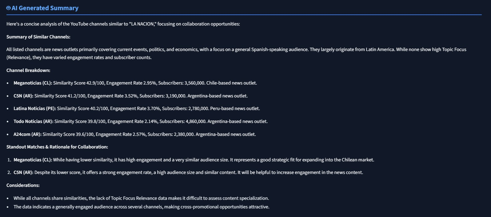

- **Seed detailed match analysis**: Deep dive into why channels match the seed.
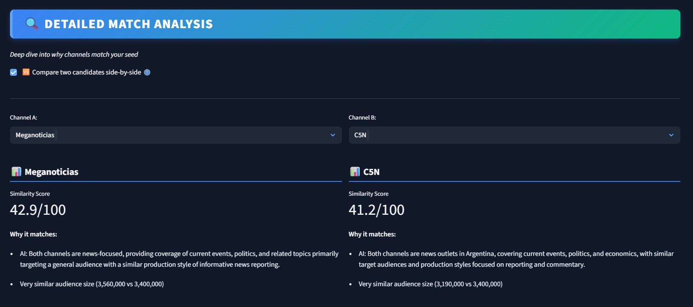

  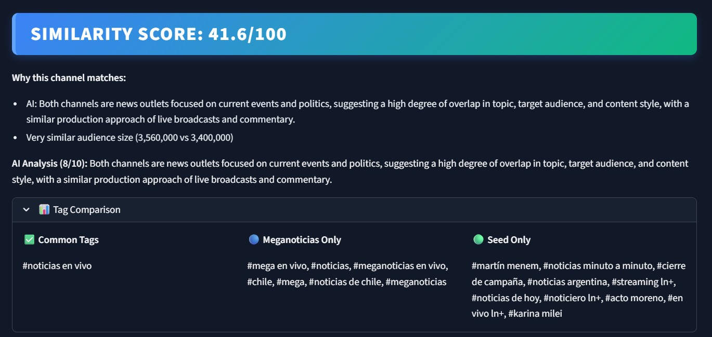
</details>

---

<details>
<summary><strong>📊 Debug & Monitoring System</strong></summary>

### Real-Time API Tracking

### Debug Panel
*Collapsible sidebar provides transparency into API usage and performance metrics*

Toggle debug mode to see:

**API Call Summary**

- Tracks YouTube (search, channels, videos, playlists)
- Tracks Gemini (summary, outreach, similarity)
- Shows quota units consumed
- Estimates costs

**Performance Timing**

- Measures each pipeline stage
- Identifies bottlenecks
- Total execution time

**Quota Efficiency**

- Compares current vs baseline usage
- Tracks total runs for same search
- Shows cache effectiveness

</details>

<details>
<summary><strong>📈 Feedback & Analytics</strong></summary>

CCSeeker includes a feedback collection system and ML-powered analytics to track and improve search quality.

### How It Works

After each search, users can provide feedback:
- **Thumbs up** - Results were helpful
- **Thumbs down** - Results missed the mark (with reason: few results, low quality, wrong topic, or other)

### Data Collected

All feedback is stored locally in `.feedback_data.json`:

Timestamp, Search mode, query, results count

Top 5 results with (channel name, id, url and score)

Feedback, reason, Filter settings, AI enabled flag

**Seed mode captures detailed scoring component breakdown**

### Analytics Use Cases

- **Satisfaction tracking** - Positive vs. negative feedback ratio by search mode
- **Failure analysis** - Which reasons appear most frequently
- **Score calibration** - What scores correlate with user satisfaction
- **Filter effectiveness** - Which filter combinations yield better results
- **AI Lift** - Gemini correlation with satisfaction

Export feedback to CSV via the debug panel for external analysis.

### ML Analytics Module (`app/analytics/`)

CCSeeker includes an analytics module for learning optimal scoring weights from feedback data:

| Module | Purpose |
|--------|---------|
| `synthetic_data_generator.py` | Generate synthetic feedback for testing ML pipelines |
| `ml_trainer.py` | Train logistic regression models with cross-validation |
| `weight_optimizer.py` | Optimize similarity scoring weights based on feedback |
| `fabric_export.py` | Export data to Microsoft Fabric/Power BI formats |

### Roadmap

- [x] Export to cloud storage (Microsoft Fabric)
- [ ] Build dashboards to track search quality
- [x] ML models to learn optimal scoring weights (logistic regression with cross-validation)
- [ ] Automated feedback loop to improve scoring over time

</details>

<details>
<summary><strong>📐 Scoring Methodology</strong></summary>

CCSeeker uses two distinct scoring systems depending on search mode.

### Relevance Score (Keyword Search Mode)

Measures how well a channel's content matches your search terms.

**Algorithmic Calculation:**

1. **Per-Video Scoring** - Each video is checked for keyword matches:
   | Match Location | Weight | Example Score |
   |----------------|--------|---------------|
   | Title only | 2.0 | 0.67 (2×1 + 1×0) / 3 |
   | Tags only | 1.0 | 0.33 (2×0 + 1×1) / 3 |
   | Both title + tags | 3.0 | 1.00 (2×1 + 1×1) / 3 |
   | No match | 0 | 0.00 |

2. **Channel Score** - Average of all video scores for that channel

3. **AI Enhancement** (when Gemini configured):
   - Gemini evaluates semantic relevance of video titles to query
   - **Final Score = 80% algorithmic + 20% AI**

**Interpretation:**
- **≥15%**: High relevance - channel frequently covers your topics
- **5-15%**: Moderate relevance - occasional topic coverage
- **<5%**: Low relevance - topic appears rarely

### Similarity Score (Channel-as-Seed Mode)

Measures how similar a candidate channel is to your seed channel.

**Algorithmic Scoring (100 points total):**

| Factor | Points | How It's Calculated |
|--------|--------|---------------------|
| **Tag Overlap** | 30 | Jaccard similarity on video tags: \|A∩B\| / \|A∪B\| |
| **Keyword Overlap** | 30 | Jaccard similarity on keywords extracted from video titles |
| **Subscriber Similarity** | 15 | Ratio-based: same size = 15pts, 2× difference = 7.5pts |
| **Engagement Rate** | 17 | Inverse of absolute difference (0.10+ diff → 0pts) |
| **Upload Frequency** | 8 | Ratio-based: similar posting schedule scores higher |

**AI Enhancement** (when Gemini configured):
- Top 10 channels analyzed for "vibe" similarity (topic, style, audience, production)
- Gemini rates similarity 0-10, normalized to 0-100
- **Final Score = 80% algorithmic + 20% AI**

**Interpretation:**
- **≥60**: Strong match - very similar content and audience
- **40-60**: Good match - significant overlap in niche
- **20-40**: Moderate match - some common ground
- **<20**: Weak match - different content focus

</details>


<details>
<summary><strong>🚀 Tech Stack</strong></summary>


| Technology | Purpose | Why This Choice |
|------------|---------|-----------------|
| **Python 3.11** | Core language | Rich ecosystem for data processing |
| **Streamlit 1.49** | Web UI framework | Built-in caching, state management, rapid iteration |
| **YouTube Data API v3** | Channel/video data | Official API, ToS-compliant (no scraping) |
| **Google Gemini AI** | Topic extraction & content generation | Free tier (15 RPM, 1M tokens/min) |
| **Pandas** | Data processing | Efficient filtering and transformations |
| **pytest** | Unit testing | Industry standard, easy mocking |

### Key Design Decisions

**Layered Architecture**
- Core business logic separated from UI in `app/core/`
- Pure functions that are Streamlit-agnostic and unit testable
- Cache layer wraps core functions with Streamlit caching

**Blended Scoring (80% Algorithmic + 20% AI)**
- Algorithmic scoring is deterministic and fast
- AI adds semantic understanding for nuanced matching
- Blend gets benefits of both approaches

**Per-Channel Caching**
- Traditional approach: Cache entire search results → duplicates videos from popular channels
- CCSeeker approach: Cache each channel's videos independently (24hr TTL)
- Benefit: Popular channels appear in multiple searches → reuse cached data

**Filter Before Fetching Videos**
- Apply subscriber/country filters BEFORE analyzing videos
- Saves API quota - no point fetching 10 videos from a 500-sub channel if minimum is 10K

</details>


<details>
<summary><strong>🧪 Testing</strong></summary>

CCSeeker has a comprehensive test suite covering core business logic.

### Running Tests

```bash
# Run all tests
pytest tests/

# Run specific module
pytest tests/test_pipeline.py

# Run with verbose output
pytest tests/ -v
```

### Test Coverage

| Module | Tests | Coverage |
|--------|-------|----------|
| `test_query_utils.py` | 21 | Query validation, URL parsing, edge cases |
| `test_relevance.py` | 13 | Keyword matching, weights, empty inputs |
| `test_youtube_api.py` | 29 | Search results, channel stats, error handling |
| `test_gemini_api.py` | 31 | AI scoring, summary generation, API failures |
| `test_pipeline.py` | 26 | Full pipeline, filters, early exits, callbacks |
| `test_seed_topics.py` | 46 | Seed topic extraction, language detection |
| `test_analytics.py` | 27 | ML training, weight optimization |
| `test_feedback_tracker.py` | 27 | Feedback persistence, export |
| `test_scoring_version.py` | 26 | Scoring weights, version management |
| `test_performance.py` | 16 | Performance benchmarks, timing consistency |

All tests use mocked API clients - no actual API calls needed.

</details>


<details>
<summary><strong>📦 Installation</strong></summary>

### Prerequisites
- Python 3.11
- [YouTube Data API v3 key](https://console.cloud.google.com/apis/credentials) (required)
- [Google Gemini API key](https://aistudio.google.com/apikey) (optional - enables AI features)

### Setup

```bash
# Clone repository
git clone https://github.com/MartinDorado/CCSeeker.git
cd CCSeeker

# Create virtual environment
python -m venv .venv

# Activate virtual environment
# Windows:
.venv\Scripts\activate
# macOS/Linux:
source .venv/bin/activate

# Install dependencies
pip install -r requirements.txt

# Configure API keys
create .env manually
# Edit .env and add your keys:
# YOUTUBE_API_KEY=your_youtube_key_here
# GEMINI_API_KEY=your_gemini_key_here
```

### Run

```bash
streamlit run app/main.py
```

App opens at `http://localhost:8501`

</details>


<details>
<summary><strong>📖 Usage</strong></summary>

<details>
<summary><strong>⚡ Quick Start: Keyword Search</strong></summary>

1. Select **🔑 Keywords** mode
2. Enter 1-2 search terms (e.g., "manga, anime")
3. Relevant in: Country (default: Global)
4. Set filters:
   - Minimum subscribers (default: 1,000)
   - Channel's origin country (default: Global)
   - Recent activity (default: 8 months)
5. Click **Find Creators**

Results show:
- Relevance score (80% keyword match + 20% AI)
- Subscriber count
- Average views per video
- Engagement rate
- Country

</details>

<details>
<summary><strong>⚡ Quick Start: Channel-as-Seed</strong></summary>

1. Select **📺 Channel-as-Seed** mode
2. Paste YouTube channel URL
3. Click **Analyze Seed**
4. Review extracted topics and AI summary
5. Optionally edit generated search query
6. Set filters and click **Find Similar Channels**

Results ranked by similarity score (0-100) with match reasons.

</details>
<details>
<summary><strong>🤖 AI Features</strong></summary>


**Seed Channel Summary** (Channel-as-Seed mode)
- Automatically generated when analyzing a seed channel
- Provides AI-powered description of the channel's content focus
- Requires Gemini API key configured

**Generate Summary** (after search completes)
- Scroll to AI Generated Summary section
- Automatically creates overview of top channels

**Create Outreach Emails**
- Select language (English/Español)
- Click **Generate Outreach Drafts**
- Get personalized email templates for TOP 3.

</details>
</details>


<details>
<summary><strong>🗂️ Project Structure</strong></summary>

```
CCSeeker/
├── app/
│   ├── core/           # Pure business logic (Streamlit-agnostic, testable)
│   ├── cache/          # Streamlit caching wrappers
│   ├── analytics/      # ML training, weight optimization, Fabric export
│   ├── main.py         # UI and integration
│   └── *.py            # Utilities (similarity, debug, feedback)
│
├── tests/              # Unit tests (262 tests, mocked APIs)
├── docs/               # Icons and screenshots
├── ARCHITECTURE.md     # Technical deep dive (scoring, caching, pipelines)
├── CLAUDE.md           # Developer quick reference
└── README.md           # This file
```

**Key Entry Points:**

| Function | Location | Purpose |
|----------|----------|---------|
| `run_search_pipeline()` | `app/core/pipeline.py` | Main search orchestration |
| `analyze_seed_channel()` | `app/core/seed_topics.py` | Seed channel topic extraction |
| `calculate_similarity_score()` | `app/similarity_engine.py` | Multi-factor channel comparison |
| `get_weight_config()` | `app/core/scoring_version.py` | Centralized scoring weights |

See [CLAUDE.md](CLAUDE.md) for full module reference and [ARCHITECTURE.md](ARCHITECTURE.md) for detailed design docs.

</details>


<details>
<summary><strong>📊 API Quotas & Costs</strong></summary>

### YouTube Data API v3 (Free Tier)
- **Daily Quota**: 10,000 units
- **Cost per operation**:
  - Search: 100 units
  - Channels: 1 unit
  - Videos: 1 unit
  - Playlists: 1 unit

**Typical search cost**: ~404 units (varies based on number of search terms, cache hits and results found)

Enable debug mode to see real-time usage.

### Google Gemini API (Free Tier)
- **Rate Limits**: 15 requests/min, 1M tokens/min
- **Cost**: Free tier available
- **Paid tier**: ~$0.10-0.30 per 1M tokens (if needed)

</details>


<details>
<summary><strong>🔒 Security & Best Practices</strong></summary>

- ✅ API keys stored in `.env` (git-ignored)
- ✅ Graceful error handling for API failures
- ✅ Input validation (query truncation, URL parsing)
- ✅ Rate limiting awareness via debug panel
- ✅ No web scraping (ToS-compliant API usage)

</details>

<details>
<summary><strong>🚧 Known Limitations</strong></summary>

- **YouTube API Quota**: 10K units/day limits search volume
- **Language Support**: Seed topic extraction optimized for English/Spanish content. Other languages fall back to English stopwords.
- **Cache Staleness**: 24hr TTL in video details fetch, which may show outdated data for rapidly changing channels
- **Ephemeral storage on Streamlit Cloud**: See [Deployment section](#deployment-streamlit-cloud)


</details>

<details>
<summary><strong>⚡ Performance</strong></summary>

Measured via debug panel (January 2026):

### Keyword Search Mode

| Scenario | Total Time | Quota Used |
|----------|------------|------------|
| 1 term, cold cache, no AI | 9-10s | ~400 units |
| 1 term, warm cache, no AI | <0.1s | ~100 units |
| 1 term, warm cache, with AI | 17-19s | ~100 units |
| 2 terms, warm cache, with AI | 20-25s | ~200 units |

### Seed-Based Search Mode

| Scenario | Total Time | Quota Used |
|----------|------------|------------|
| 1 term, cold cache, no AI | 12-15s | ~450 units |
| 1 term, warm cache, no AI | <0.5s | ~100 units |
| 2 terms, warm cache, with AI | 35-45s | ~200 units |

### Key Insights

- **Cache benefit**: 99% faster, 75% less quota on repeat searches
- **AI overhead**: +17-20s when AI relevance scoring enabled
- **Bottlenecks**: Video details fetch (without AI) · AI relevance scoring (with AI)
- **Searches/day**: 25-100 on free tier (depending on terms and cache state)

### Pipeline Steps (Both Modes)

| Step | Description |
|------|-------------|
| 1. Search | YouTube API video/channel search |
| 2. Channel Stats | Fetch subscriber counts, country |
| 3. Video Details | Fetch recent videos per channel |
| 4. AI Relevance | Gemini semantic analysis (optional) |
| 5. Similarity | Compare to seed profile (seed mode only) |
| 6. AI Generation | Generate summary (optional) |

See [ARCHITECTURE.md](ARCHITECTURE.md#performance--efficiency) for detailed breakdown.

</details>

<details>
<summary><strong>☁️ Deployment (Streamlit Cloud)</strong></summary>

CCSeeker is deployed on [Streamlit Community Cloud](https://ccseeker.streamlit.app/).

### Secrets Configuration

Add API keys in Streamlit Cloud dashboard → Settings → Secrets:
```toml
YOUTUBE_API_KEY = "your_key"
GEMINI_API_KEY = "your_key"  # Optional
```
### Storage Behavior

| Cache Type | Storage | Local | Streamlit Cloud |
|------------|---------|-------|-----------------|
| `@st.cache_data` | RAM | Persists while running | **Resets on restart** |
| `.quota_cache.json` | Filesystem | Persists indefinitely | **Resets on restart** |
| `.feedback_data.json` | Filesystem | Persists indefinitely | **Resets on restart** |

App restarts occur on: idle timeout (~7 days), git push, platform maintenance.

### Known Limitations

- **No persistent storage**: `.feedback_data.json` and `.quota_cache.json` reset on app restarts
- **Memory limits**: ~1GB RAM on free tier
- **Timeout**: Long-running operations may timeout after 10 minutes

</details>

<details>
<summary><strong>🧭 Scaling Considerations</strong></summary>

CCSeeker is currently architected as a single-user portfolio application. Below are the architectural decisions I'd make if usage patterns required scaling.

| Trigger | Architectural Change | Rationale |
|---------|---------------------|-----------|
| Multiple concurrent users | Server-side cache (Redis/Postgres) | Streamlit Community Cloud restarts invalidate in-memory caches |
| API quota becomes bottleneck | BYOK (Bring Your Own Key) | Let users provide their own YouTube/Gemini API keys |
| User-specific search history needed | Google OAuth authentication | Can't persist user data without identity |
| Uptime/reliability requirements | Docker deployment on paid hosting | Control over restarts, resource allocation |
| Per-search costs justify gating | Budget-aware search flow | Run Deep analysis only on user-selected shortlist, not all candidates |
| Feedback data volume grows | Migrate from local `.json` to cloud storage | Local file doesn't persist on Streamlit Cloud restarts |

**Current architecture handles:** 25 one term searches/day within free API quotas, with 24-hour cached results reducing redundant API calls by approximately 75% on repeat searches.


</details>

<details>
<summary><strong>📄 License</strong></summary>

This project is licensed under the Apache License 2.0 - see [license.txt](LICENSE) for details.
Free for personal and educational use.
For commercial licensing inquiries, contact doradomartin.10@gmail.com.
</details>

<details>
<summary><strong>👤 Author</strong></summary>

**Martín Dorado**
- LinkedIn: [linkedin.com/in/martin-dorado](https://www.linkedin.com/in/martin-dorado/)
- GitHub: [@MartinDorado](https://github.com/MartinDorado)
</details>

<details>
<summary><strong>📚 Additional Resources</strong></summary>

- **[ARCHITECTURE.md](ARCHITECTURE.md)** - Deep dive into system design, scoring algorithms, and caching
- **[CLAUDE.md](CLAUDE.md)** - Quick reference for AI assistants and developers
- **[YouTube API Docs](https://developers.google.com/youtube/v3)** - Official API reference
- **[Gemini API Guide](https://ai.google.dev/docs)** - AI integration documentation
- **[Streamlit Docs](https://docs.streamlit.io)** - Streamlit

---

<div align="center">

</div>
